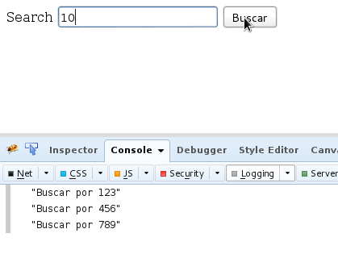

Este artigo mostra como atribuir funções aos eventos de uma visão (view) em Backbone (framework JavaScript). O artigo
faz parte de uma série, veja menu a direita para visualizar a sêquencia de artigos.

Obviamente, suas visões terão elementos que visam sofrer algum tipo de evento do usuário. Com Backbone há 2 ou 3 formas
para atribuírmos os eventos. Mas a primeira forma que você deve aprender é a que utiliza a propriedade `events` das Views.

Como acabei de dizer, os templates do Backbone possuem o método 
[events()](http://backbonejs.org/#View-delegateEvents) e "formato" deve seguir o esquema abaixo.

```javascript
var ViewQualquer = Backbone.View.extend({
    el: {},
    initialize: function(){
    },
    //
    // Utilize a propriedade `events` para delegar eventos
    // aos elementos de sua view
    //
    events: {
        "tipo-de-envento"              : "função de callback",
        "tipo-de-envento id-elemento"  : "função de callback",
        etc...
    },
    render: function(){
    }
});
var search_view = new SearchView();
```


### Exemplo

O formulário abaixo é o mesmo da matéria anterior, veja seu formato.


O trecho HTML equivalente é mostrado abaixo.

```html
    ...
    <body>

        <!-- Template -->
        <script type="text/template" id="formulario-template">
          <label>Search</label>
          <input type="text" id="txtTermo" />
          <input type="button" id="btnBuscar" value="Buscar" />
        </script>

        <!-- Container onde o template será renderizado -->
        <div id="formulario-container"></div>
    ...
```

Nosso objetivo é atribuir um evento ao botão que, quando disparado, executará uma função que, por sua vez, deverá mostrar
no console o conteúdo da caixa de texto, por tanto, fique com o console de JavaScript aberto para ver os resultados.

Temos um botão em nosso template, como atribuiremos um evento a ele ?

Acrescentamos o evento `click` ao botão `#searchInput` conforme o código abaixo.

```javascript
var SearchView = Backbone.View.extend({
    el: $("#formulario-container"),  
    initialize: function(){
        this.render();
    },
    render: function(){
        this.template = _.template( $("#formulario-template").html(), {} );
        this.$el.html( this.template );
    },
    //
    // Delegando eventos
    //
    events: {
        // Evento click para o único botão do template
        // executamos o callback `doSearch` quando o evento é disparado
        "click input[type=button]": "doSearch"
    },
    //
    // Função de callback para o evento do botão
    //
    doSearch: function( event ){
        console.log( "Buscar por " + $("#txtTermo").val() );
    }  
  
});
var search_view = new SearchView();
```

Veja o resultado do código acima ilustrado pela imagem abaixo.

